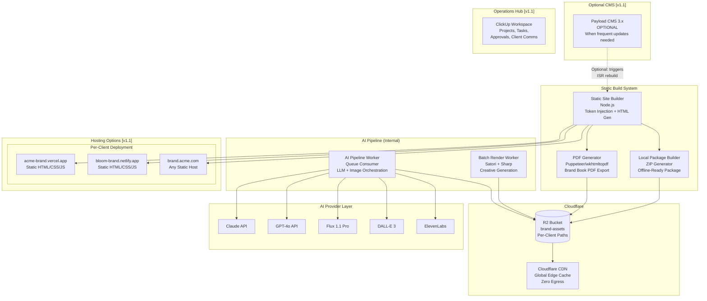
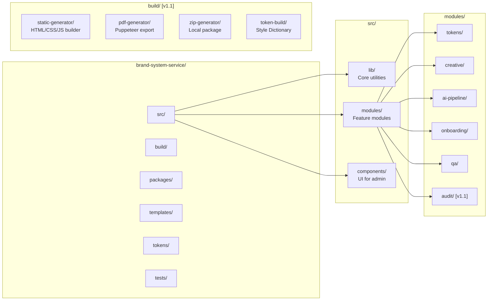
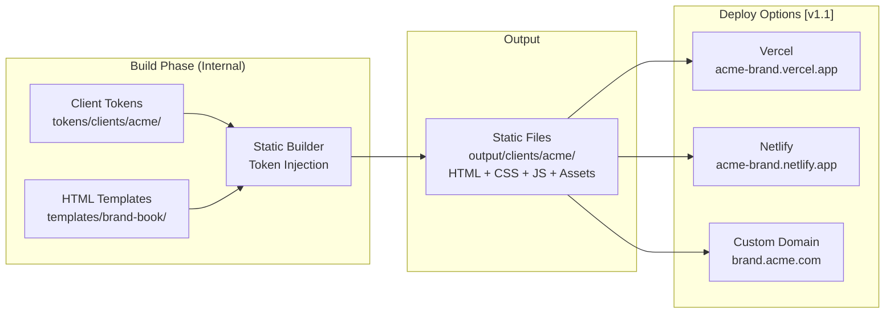
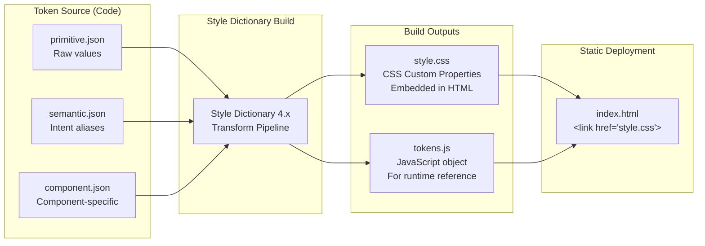
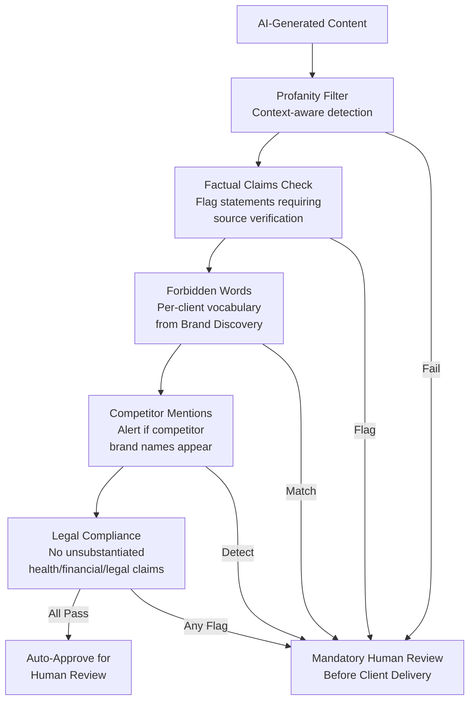
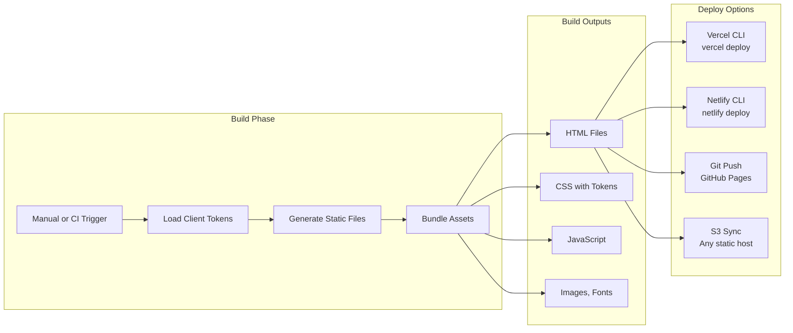
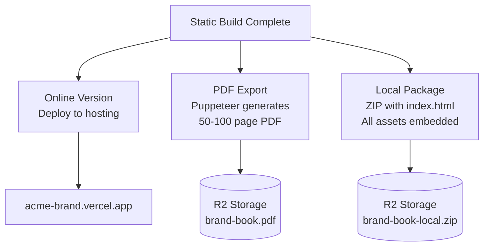
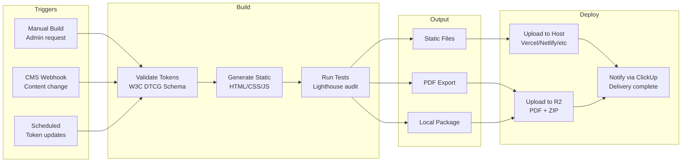

# Brand System Service - Technical Architecture Document

**Version:** 1.1
**Date:** 2026-03-09
**Author:** Aria (Architect Agent)
**Status:** APPROVED
**Source PRD:** `docs/prd-brand-system-service.md` (v1.2, MVP Simplification Release)
**Source Epics:** `docs/epics-brand-system-service.md` (v1.1)
**Source Schema:** `docs/schema-brand-system-service.md` (v1.0)
**PRD Review:** `docs/review-prd-brand-system-service.md`
**Epic Review:** `docs/review-epic-decomposition.md`

---

## Change Log

| Date | Version | Description | Author |
|------|---------|-------------|--------|
| 2026-03-05 | 1.0 | Initial architecture based on PRD v1.1 | Aria |
| 2026-03-09 | 1.1 | **Static-First Simplification:** (1) Static HTML/CSS/JS as default for Brand Book, Landing Pages, Sites; (2) ClickUp replaces proprietary Client Portal for MVP operations; (3) Simplified multi-tenant with per-client static hosting and build-time token injection; (4) Brand Book triple delivery (online + PDF + local package); (5) Payload CMS marked OPTIONAL; (6) Phase 2 migration path documented; (7) New ADRs for Static-First and ClickUp Operations; (8) Simplified Container Diagram; (9) Static Build Pipeline section added; (10) Updated FR/NFR coverage for v1.2 requirements | Aria |

---

## Table of Contents

1. [C4 Model Architecture](#1-c4-model-architecture)
   - [Level 1: System Context](#11-level-1-system-context)
   - [Level 2: Container Diagram](#12-level-2-container-diagram)
   - [Level 3: Component Diagram](#13-level-3-component-diagram)
   - [Level 4: Code Structure](#14-level-4-code-structure)
2. [Tech Stack Decisions (ADRs)](#2-tech-stack-decisions-adrs)
3. [API Design](#3-api-design)
4. [Project Structure](#4-project-structure)
5. [Multi-Tenant Architecture](#5-multi-tenant-architecture)
6. [AI Pipeline Architecture](#6-ai-pipeline-architecture)
7. [Security Architecture](#7-security-architecture)
8. [Deployment Architecture](#8-deployment-architecture)
9. [Static Build Pipeline](#9-static-build-pipeline)

---

## 1. C4 Model Architecture

### 1.1 Level 1: System Context

The BSS MVP interacts with external systems for storage, AI generation, and deployment. **[v1.1 CHANGE]** Client operations flow through ClickUp rather than a proprietary portal. Payload CMS is optional. Static hosting is the default deployment target.

```mermaid
graph TB
    subgraph Users
        CLIENT[Client User<br/>B2B Customer]
        ADMIN[Internal Admin<br/>Design Lead / PM]
    end

    BSS[Brand System Service<br/>Static-First Architecture<br/>Brand identity, creatives, and<br/>landing pages as HTML/CSS/JS]

    subgraph "Operations Hub [v1.1]"
        CLICKUP[ClickUp<br/>Project Management<br/>Client Communication<br/>Approvals & Revisions]
    end

    subgraph External Systems
        R2[Cloudflare R2<br/>S3-Compatible<br/>Asset Storage]
        CLAUDE[Claude API<br/>Anthropic<br/>Text Generation]
        GPT[OpenAI GPT-4o<br/>Text Generation<br/>Fallback Provider]
        FLUX[Flux 1.1 Pro<br/>Replicate<br/>Image Generation]
        DALLE[DALL-E 3<br/>OpenAI<br/>Image Generation Fallback]
        ELEVENLABS[ElevenLabs<br/>Voice Synthesis<br/>Video Voiceover]
        RESEND[Resend<br/>Email Service Provider<br/>Transactional]
        REMOTION[Remotion Lambda<br/>AWS Lambda<br/>Video Rendering]
        FIGMA[Figma API<br/>Design Tool<br/>Token Sync via Tokens Studio]
        SENTRY[Sentry<br/>Error Tracking<br/>Monitoring]
    end

    subgraph "Hosting [v1.1 - Flexible]"
        VERCEL[Vercel<br/>Static Hosting<br/>CDN]
        NETLIFY[Netlify<br/>Static Hosting<br/>Alternative]
        ANYHOST[Any Static Host<br/>GitHub Pages, S3, etc.]
    end

    CLIENT -->|Reviews via ClickUp,<br/>downloads assets| BSS
    ADMIN -->|Manages projects,<br/>reviews AI output,<br/>publishes content| BSS
    CLIENT <-->|Approvals, feedback,<br/>project tracking| CLICKUP
    ADMIN <-->|Project management,<br/>client communication| CLICKUP

    BSS -->|Stores/retrieves<br/>brand assets| R2
    BSS -->|Generates copy,<br/>brand voice,<br/>SEO content| CLAUDE
    BSS -->|Fallback text<br/>generation| GPT
    BSS -->|Generates images,<br/>moodboards,<br/>backgrounds| FLUX
    BSS -->|Image generation<br/>fallback| DALLE
    BSS -->|Video voiceover<br/>synthesis| ELEVENLABS
    BSS -->|Sends emails,<br/>onboarding sequences| RESEND
    BSS -->|Serverless video<br/>rendering| REMOTION
    BSS -->|Pushes design tokens<br/>to Figma Variables| FIGMA
    BSS -->|Error tracking,<br/>performance monitoring| SENTRY

    BSS -->|Deploy static sites| VERCEL
    BSS -->|Alternative deploy| NETLIFY
    BSS -->|Any static deploy| ANYHOST
```



### 1.2 Level 2: Container Diagram

**[v1.1 CHANGE]** Simplified architecture reflecting static-first approach. Payload CMS is optional. Client operations via ClickUp. Per-client static hosting instead of runtime multi-tenant middleware.



### 1.3 Level 3: Component Diagram

**[v1.1 CHANGE]** Simplified to reflect static-first architecture. Portal Module replaced by ClickUp integration. Added Static Build Module.

```mermaid
graph TB
    subgraph BuildSystem["Static Build System Components"]

        subgraph StaticBuildModule["Static Build Module [v1.1]"]
            TOKENINJECTOR[Token Injector<br/>Build-Time CSS Variables]
            HTMLGENERATOR[HTML Generator<br/>Brand Book, Landing, Site]
            ASSETBUNDLER[Asset Bundler<br/>Fonts, Images, CSS, JS]
            RELATIVEPATHS[Path Relativizer<br/>NFR-9.2 Compliance]
        end

        subgraph DeliveryModule["Delivery Module [v1.1]"]
            ONLINEDEPLOY[Online Deploy<br/>Vercel/Netlify/Any Host]
            PDFEXPORT[PDF Export<br/>Puppeteer/wkhtmltopdf]
            LOCALPACKAGE[Local Package<br/>ZIP with index.html]
            SEARCHINDEX[Search Index<br/>Fuse.js Client-Side]
        end

        subgraph TokenEngine["Design Token Engine"]
            TOKENSCHEMA[Token Schema<br/>W3C DTCG Validator]
            STYLEDICT[Style Dictionary 4.x<br/>Transform Pipeline]
            COLORENGINE[Color Palette Engine<br/>WCAG Contrast Checker]
            TYPOENGINE[Typography System<br/>CSS Clamp Generator]
            GRIDENGINE[Grid & Spacing<br/>8px Base Grid]
        end

        subgraph BrandBookModule["Brand Book Module"]
            BBGENERATOR[Site Generator<br/>Per-Client Template]
            VOICEGEN[Voice & Manifesto<br/>Generator]
        end

        subgraph CreativeModule["Creative Production Module"]
            TEMPLATEENGINE[Template Engine<br/>Satori JSX-to-SVG]
            RASTERIZER[Rasterizer<br/>Sharp PNG/WebP]
            BATCHPIPELINE[Batch Pipeline<br/>30 Posts in ~12min]
            PLATFORMEXPORT[Platform Exporter<br/>Dimension + Format]
        end

        subgraph AIPipelineModule["AI Pipeline Module"]
            PROVIDERABSTRACTION[Provider Abstraction<br/>Claude / GPT / Flux / DALL-E]
            JOBQUEUE[Job Queue<br/>Backpressure + Throttle]
            PROMPTLIB[Prompt Template Library<br/>Versioned + A/B Testing]
            QUALITYSCORING[Quality Scoring<br/>5-Dimension Rating]
            CONTENTMOD[Content Moderation<br/>Filters + Flagging]
            COSTTRACKER[Cost Tracker<br/>Per-Client Budget Cap]
        end

        subgraph OnboardingModule["Onboarding Module"]
            WIZARD[Intake Wizard<br/>ClickUp Form or Tally]
            AUDITPIPELINE[Digital Audit [v1.1]<br/>Existing Presence Analysis]
            AIANALYSIS[AI Analysis Pipeline<br/>Vision + Palette +<br/>Moodboard + Tokens]
            HUMANREVIEW[Human Review UI<br/>Internal Validation]
        end

        subgraph QAModule["QA Module"]
            REVIEWCHECKLIST[Review Checklists<br/>7-8 Items Per Category]
            REVISIONMGMT[Revision Management<br/>3 Rounds per Type<br/>via ClickUp Tasks]
            TRAININGGEN[Training Material<br/>Generator]
        end

        subgraph SecurityModule["Security Module"]
            SIGNEDURLS[Signed URL Generator<br/>15min API / 1h Download]
            MALWARESCAN[Malware Scanner<br/>ClamAV Integration]
        end

        subgraph ObservabilityModule["Observability Module"]
            AILOGGER[AI API Logger<br/>Cost + Latency + Status]
            HEALTHCHECK[Health Checker<br/>Service Status]
            ALERTING[Alerting Engine<br/>Budget + Error Thresholds]
        end
    end

    TokenEngine --> StaticBuildModule
    StaticBuildModule --> DeliveryModule
    AIPipelineModule --> CreativeModule
    AIPipelineModule --> OnboardingModule
    AIPipelineModule --> BrandBookModule
    QAModule --> CreativeModule
    QAModule --> BrandBookModule
    ObservabilityModule --> AIPipelineModule
```

### 1.4 Level 4: Code Structure

**[v1.1 CHANGE]** Added static build tooling. Simplified portal structure (now internal admin only, client ops via ClickUp).



---

## 2. Tech Stack Decisions (ADRs)

### ADR-001: Static-First Architecture [NEW v1.1]

| Attribute | Detail |
|-----------|--------|
| **Status** | ACCEPTED |
| **Context** | PRD v1.2 mandates static HTML/CSS/JS as default for Brand Book, Landing Pages, and Institutional Sites. Next.js/CMS are optional for dynamic features. MVP must be deployable to any static host without server dependencies. |
| **Decision** | Default to static HTML/CSS/JS generation. Build pipeline injects design tokens at build time. Three delivery formats: online deploy, PDF export, local package (ZIP with index.html). |
| **Rationale** | (1) Maximum portability -- any hosting platform works. (2) Simplified MVP infrastructure -- no runtime multi-tenant middleware. (3) Local package opens via file:// in any browser per NFR-9.1. (4) Relative paths enable portability per NFR-9.2. (5) Client-side search via Fuse.js works offline. (6) Reduces operational complexity for Phase 1. |
| **Alternatives** | Next.js SSR for all (more complex, requires Vercel-specific features), Jamstack with Gatsby (heavier build, GraphQL overhead). |
| **Consequences** | Dynamic features (real-time updates, server-side personalization) require CMS add-on. Search limited to client-side. No server-side analytics without external tracking. |
| **PRD Refs** | FR-1.7 (revised), FR-3.5 (revised), FR-3.6 (revised), NFR-9.1-9.5 |

### ADR-002: ClickUp as Operations Hub [NEW v1.1]

| Attribute | Detail |
|-----------|--------|
| **Status** | ACCEPTED |
| **Context** | PRD v1.2 defers proprietary Client Portal to Phase 2. MVP needs client-facing operations: project tracking, approvals, revisions, communication. ClickUp Business ($12/user/mo) provides all required functionality. |
| **Decision** | Use ClickUp for all MVP client operations. Proprietary portal is Phase 2 enhancement when scaling beyond 40 clients. |
| **Rationale** | (1) Zero development cost for client-facing project management. (2) Built-in approval workflows via task comments and custom fields. (3) Client communication integrated with project context. (4) Forms for intake questionnaires. (5) Dashboards for operational metrics per NFR-6.5. (6) Reduces MVP scope by 3-4 weeks (EPIC-BSS-6 simplified). |
| **Alternatives** | Build proprietary portal (4 weeks dev), Notion (weaker approval workflows), Asana (similar but pricier). |
| **Consequences** | Vendor dependency on ClickUp. Custom branding limited. Client experience less polished than proprietary solution. Phase 2 migration requires data export/import. |
| **PRD Refs** | FR-8.1 (revised), FR-8.5 (revised), FR-8.6 (revised), FR-8.7 (revised), NFR-9.10 |

### ADR-003: Per-Client Static Hosting [REVISED v1.1]

| Attribute | Detail |
|-----------|--------|
| **Status** | ACCEPTED (replaces multi-tenant subdomain routing in MVP) |
| **Context** | PRD v1.2 simplifies multi-tenancy for MVP. Runtime token injection via middleware is deferred to Phase 2. Build-time token injection with per-client deployments is simpler and equally functional. |
| **Decision** | Each client gets a separate static deployment (e.g., acme-brand.vercel.app, bloom-brand.netlify.app). Tokens injected at build time, not runtime. Custom domains via CNAME to static deployment. |
| **Rationale** | (1) No middleware complexity. (2) Any hosting platform works. (3) Build-time token injection is deterministic. (4) Custom domains are straightforward CNAME. (5) Phase 2 can migrate to subdomain routing when needed. |
| **Alternatives** | Runtime multi-tenant (defer to Phase 2), Single deployment with URL-based routing (complex without SSR). |
| **Consequences** | Separate deployment per client. CI/CD must handle multiple deployments. Phase 2 migration path documented. |
| **PRD Refs** | FR-1.12 (revised), NFR-1.4 (revised), NFR-9.3 |

### ADR-004: Cloudflare R2 (Asset Storage)

| Attribute | Detail |
|-----------|--------|
| **Status** | ACCEPTED (unchanged from v1.0) |
| **Context** | Need S3-compatible object storage for brand assets. Brand books contain many image assets (logos, icons, moodboards, social templates) that clients download frequently. Egress costs are a significant concern for asset-heavy delivery. |
| **Decision** | Use Cloudflare R2 as the primary asset storage. |
| **Rationale** | (1) **Zero egress fees** -- the critical differentiator. (2) S3-compatible API -- same AWS SDK works. (3) Built-in CDN via Cloudflare network. (4) $0.015/GB/month storage. (5) Signed URLs for secure access with configurable expiry. |
| **Alternatives** | AWS S3 ($0.09/GB egress), Backblaze B2 (less CDN integration), Supabase Storage (limited). |
| **Consequences** | R2 does not support S3 Object Lock. Eventual consistency (acceptable for brand assets). |
| **PRD Refs** | FR-8.3, NFR-1.6, NFR-5.3 |

### ADR-005: Satori + Sharp (Creative Rendering Pipeline)

| Attribute | Detail |
|-----------|--------|
| **Status** | ACCEPTED (unchanged from v1.0) |
| **Context** | Need to render social media templates programmatically from JSX/React components to PNG/WebP images for batch creative generation. |
| **Decision** | Use Satori (Vercel) for JSX-to-SVG conversion and Sharp for SVG-to-PNG/WebP rasterization. |
| **Rationale** | (1) Satori converts React JSX directly to SVG. (2) No browser overhead (vs Puppeteer). (3) 60-70% faster than Puppeteer for batch rendering. (4) Sharp is the fastest Node.js image processing library. |
| **Alternatives** | Puppeteer (full CSS support but 3x slower), Canva API (too limited), Figma API (10 RPM rate limit). |
| **Consequences** | Satori does NOT support CSS Grid (flexbox only). Complex layouts may need Puppeteer fallback. |
| **PRD Refs** | FR-2.7, NFR-1.3 |

### ADR-006: Style Dictionary 4.x (Design Token Transforms)

| Attribute | Detail |
|-----------|--------|
| **Status** | ACCEPTED (unchanged from v1.0) |
| **Context** | Need to transform W3C DTCG token JSON files into multiple output formats: CSS Custom Properties, SCSS variables, Tailwind config, JSON, and Figma Variables. |
| **Decision** | Use Style Dictionary 4.x as the token transformation engine. |
| **Rationale** | (1) Industry-standard tool for design token transformation. (2) W3C DTCG format support (2025.10 stable spec). (3) Plugin architecture allows custom transforms. (4) Outputs CSS Custom Properties natively. |
| **Alternatives** | Custom transform scripts (maintenance burden), Theo by Salesforce (deprecated). |
| **Consequences** | Style Dictionary config generated per client. Build step required when tokens change. |
| **PRD Refs** | FR-1.2, NFR-2.2, NFR-3.3, CON-13 |

### ADR-007: Payload CMS 3.x [REVISED v1.1 - OPTIONAL]

| Attribute | Detail |
|-----------|--------|
| **Status** | ACCEPTED (now OPTIONAL, not default) |
| **Context** | PRD v1.2 specifies CMS is optional, used only when client requires frequent content updates. Most MVP deliverables are static-first. |
| **Decision** | Payload CMS 3.x is an **optional add-on** for clients needing frequent updates (>4/month). Default delivery is static HTML/CSS/JS. |
| **Rationale** | (1) Reduces MVP complexity. (2) Many clients don't need CMS -- brand books and landing pages rarely change. (3) CMS adds operational overhead. (4) Can offer as Tier 2/3 upgrade when needed. |
| **Alternatives** | Always include CMS (original v1.0 approach), headless CMS like Sanity (vendor lock-in). |
| **Consequences** | Clients wanting content updates without CMS must request rebuilds. CMS setup adds ~1 week per project. Documentation must explain when CMS is recommended. |
| **PRD Refs** | FR-3.5 (revised), CON-16 |

### ADR-008: Flexible Static Hosting [REVISED v1.1]

| Attribute | Detail |
|-----------|--------|
| **Status** | ACCEPTED (replaces Vercel-only in MVP) |
| **Context** | PRD v1.2 requires static sites deployable to any hosting platform per NFR-9.3. Vercel is recommended but not required. |
| **Decision** | Support deployment to any static hosting: Vercel, Netlify, GitHub Pages, AWS S3, any web server. Build output is platform-agnostic. |
| **Rationale** | (1) Maximum client flexibility. (2) No vendor lock-in. (3) Clients can use their existing infrastructure. (4) Reduces hosting cost concerns. |
| **Alternatives** | Vercel-only (original v1.0, simpler but restrictive). |
| **Consequences** | Must ensure build output is truly platform-agnostic. Preview deployments platform-specific. ISR only available on Vercel (when CMS enabled). |
| **PRD Refs** | FR-3.6 (revised), NFR-9.3 |

---

## 3. API Design

**[v1.1 CHANGE]** APIs simplified for MVP. Client Portal APIs deferred to Phase 2. Focus on internal admin APIs and build pipeline integration.

### 3.1 Internal Admin APIs (MVP)

| Method | Path | Description | Auth | Rate Limit |
|--------|------|-------------|------|------------|
| `POST` | `/api/build/brand-book` | Trigger brand book static build | Admin | 5 RPM |
| `POST` | `/api/build/landing-page` | Trigger landing page static build | Admin | 5 RPM |
| `POST` | `/api/build/pdf` | Generate PDF from brand book | Admin | 2 RPM |
| `POST` | `/api/build/local-package` | Generate ZIP local package | Admin | 2 RPM |
| `GET` | `/api/build/status/:jobId` | Check build job status | Admin | 100 RPM |

### 3.2 Token Management APIs

| Method | Path | Description | Auth | Rate Limit |
|--------|------|-------------|------|------------|
| `GET` | `/api/tokens/:clientId` | Get design tokens for client | Admin | 100 RPM |
| `POST` | `/api/tokens/:clientId` | Update design tokens | Admin | 20 RPM |
| `POST` | `/api/tokens/:clientId/build` | Trigger Style Dictionary build | Admin | 5 RPM |
| `GET` | `/api/tokens/:clientId/export/:format` | Export tokens (css, scss, tailwind, json) | Admin | 50 RPM |

### 3.3 Asset Management APIs

| Method | Path | Description | Auth | Rate Limit |
|--------|------|-------------|------|------------|
| `GET` | `/api/assets/:clientId` | List assets for client | Admin | 100 RPM |
| `POST` | `/api/assets/:clientId/upload` | Upload asset (triggers malware scan) | Admin | 20 RPM |
| `GET` | `/api/assets/:clientId/:assetId/download` | Get signed R2 URL (1h expiry) | Admin | 50 RPM |
| `POST` | `/api/assets/:clientId/batch-download` | Generate ZIP of selected assets | Admin | 5/hr |

### 3.4 AI Generation APIs

| Method | Path | Description | Auth | Rate Limit |
|--------|------|-------------|------|------------|
| `POST` | `/api/ai/generate/copy` | Generate copy (social, landing, email) | Admin | 20 RPM |
| `POST` | `/api/ai/generate/image` | Generate image (moodboard, background) | Admin | 10 RPM |
| `POST` | `/api/ai/generate/batch` | Batch generate creatives (30 posts) | Admin | 2 RPM |
| `GET` | `/api/ai/jobs/:jobId` | Check AI job status | Admin | 100 RPM |
| `POST` | `/api/ai/audit` | Run digital presence audit [v1.1] | Admin | 2 RPM |
| `GET` | `/api/ai/costs/:clientId` | Get AI cost summary for client | Admin | 20 RPM |

### 3.5 Onboarding APIs

| Method | Path | Description | Auth | Rate Limit |
|--------|------|-------------|------|------------|
| `POST` | `/api/onboarding/intake` | Submit intake questionnaire data | Admin | 5 RPM |
| `POST` | `/api/onboarding/audit` | Trigger digital presence audit [v1.1] | Admin | 2 RPM |
| `POST` | `/api/onboarding/analyze` | Trigger AI analysis pipeline | Admin | 2 RPM |
| `POST` | `/api/onboarding/setup` | Trigger automated client setup | Admin | 2 RPM |

### 3.6 Webhooks (Optional CMS)

| Method | Path | Description | Auth | Rate Limit |
|--------|------|-------------|------|------------|
| `POST` | `/api/webhooks/payload-cms` | Payload CMS content change (rebuild trigger) | HMAC | 100 RPM |

**Note:** Portal APIs (BSS-6 in v1.0) are deferred to Phase 2 when proprietary Client Portal is implemented. All client-facing operations handled via ClickUp in MVP.

---

## 4. Project Structure

**[v1.1 CHANGE]** Simplified structure reflecting static-first architecture. Added build tooling directories. Removed Portal app directory (Phase 2).

```
brand-system-service/
|
|-- .github/
|   |-- workflows/
|   |   |-- ci.yml                          # Lint + Type Check + Test
|   |   |-- build-static.yml                # Static site build [v1.1]
|   |   |-- deploy-client.yml               # Per-client deploy [v1.1]
|   |-- CODEOWNERS
|
|-- build/                                   # [v1.1] Build tooling
|   |-- static-generator/
|   |   |-- brand-book.ts                   # Brand book HTML generator
|   |   |-- landing-page.ts                 # Landing page generator
|   |   |-- institutional-site.ts           # Multi-page site generator
|   |   |-- components/                     # HTML template components
|   |-- pdf-generator/
|   |   |-- index.ts                        # Puppeteer PDF export
|   |   |-- templates/                      # PDF layout templates
|   |-- zip-generator/
|   |   |-- index.ts                        # Local package ZIP creator
|   |   |-- path-relativizer.ts             # NFR-9.2 compliance
|   |-- token-build/
|   |   |-- style-dictionary.config.ts      # Style Dictionary 4.x config
|   |   |-- transforms/                     # Custom transforms
|
|-- src/
|   |-- lib/
|   |   |-- r2/
|   |   |   |-- client.ts                   # R2 S3-compatible client
|   |   |   |-- signed-urls.ts              # Signed URL generator
|   |   |   |-- upload.ts                   # Upload with malware scan
|   |   |-- logger.ts                       # Structured logging
|   |   |-- errors.ts                       # Error classes
|   |   |-- clickup/                        # [v1.1] ClickUp integration
|   |   |   |-- client.ts                   # ClickUp API client
|   |   |   |-- tasks.ts                    # Task management
|   |   |   |-- forms.ts                    # Form integration
|   |
|   |-- modules/
|   |   |-- tokens/
|   |   |   |-- schema-validator.ts         # W3C DTCG validation
|   |   |   |-- color-engine.ts             # Palette generation + WCAG
|   |   |   |-- typography-engine.ts        # Type scale + CSS clamp
|   |   |   |-- grid-engine.ts              # Grid system + spacing
|   |   |   |-- build-pipeline.ts           # Orchestrate full build
|   |   |
|   |   |-- creative/
|   |   |   |-- template-engine.ts          # Satori rendering
|   |   |   |-- rasterizer.ts               # Sharp conversion
|   |   |   |-- batch-pipeline.ts           # Batch generation orchestrator
|   |   |   |-- platform-exporter.ts        # Per-platform dimensions
|   |   |   |-- templates/                  # JSX templates
|   |   |
|   |   |-- ai-pipeline/
|   |   |   |-- providers/                  # Provider abstractions
|   |   |   |-- job-queue.ts                # Queue with backpressure
|   |   |   |-- prompt-library.ts           # Versioned prompts
|   |   |   |-- quality-scoring.ts          # 5-dimension scoring
|   |   |   |-- content-moderation.ts       # Automated filters
|   |   |   |-- cost-tracker.ts             # Per-client cost tracking
|   |   |
|   |   |-- onboarding/
|   |   |   |-- intake-handler.ts           # Questionnaire processing
|   |   |   |-- audit-pipeline.ts           # [v1.1] Digital presence audit
|   |   |   |-- ai-analysis.ts              # AI analysis orchestrator
|   |   |   |-- client-setup.ts             # Automated provisioning
|   |   |
|   |   |-- qa/
|   |   |   |-- review-checklist.ts         # Per-category checklists
|   |   |   |-- revision-manager.ts         # ClickUp integration [v1.1]
|   |   |   |-- training-generator.ts       # Training material gen
|   |   |
|   |   |-- observability/
|   |   |   |-- ai-logger.ts                # AI API call logging
|   |   |   |-- health-checker.ts           # Service health checks
|   |   |   |-- cost-aggregator.ts          # Monthly cost dashboard
|
|-- tokens/                                  # Design token source files
|   |-- _base/                              # Base token template
|   |   |-- primitive.json                  # Raw values
|   |   |-- semantic.json                   # Intent-based aliases
|   |   |-- component.json                  # Component-specific tokens
|   |-- clients/                            # [v1.1] Per-client tokens
|   |   |-- acme/
|   |   |-- bloom/
|
|-- templates/                               # Rendering templates
|   |-- brand-book/                         # Brand book HTML templates
|   |   |-- sections/                       # Section templates
|   |   |-- components/                     # Reusable HTML components
|   |   |-- search/                         # Fuse.js integration
|   |-- landing/                            # Landing page templates
|   |-- institutional/                      # Multi-page site templates
|   |-- social/                             # Social media JSX templates
|   |-- email/                              # react-email templates
|
|-- output/                                  # [v1.1] Build output
|   |-- clients/
|   |   |-- acme/
|   |   |   |-- brand-book/                 # Static HTML/CSS/JS
|   |   |   |-- landing/
|   |   |   |-- pdf/
|   |   |   |-- local-package/              # ZIP files
|
|-- tests/
|   |-- unit/
|   |-- integration/
|   |-- e2e/
|
|-- docs/
|   |-- api-reference.md
|   |-- token-guide.md
|   |-- deployment.md
|   |-- clickup-setup.md                    # [v1.1] ClickUp configuration
|   |-- phase2-migration.md                 # [v1.1] Upgrade path
|
|-- .env.example
|-- package.json
|-- tsconfig.json
```

### Naming Conventions

| Type | Convention | Example |
|------|-----------|---------|
| Files | kebab-case | `token-loader.ts`, `brand-book.html` |
| Components | PascalCase | `ColorSwatch`, `ReviewItem` |
| Constants | SCREAMING_SNAKE_CASE | `MAX_REVISION_ROUNDS`, `R2_BUCKET_NAME` |
| Token paths | dot-separated | `color.primary.500`, `typography.heading.fontFamily` |
| R2 keys | forward-slash paths | `{client-id}/brand-identity/logo-primary.svg` |
| CSS Custom Properties | kebab-case with `--bss-` prefix | `--bss-color-primary-500` |
| Client slugs | kebab-case | `acme-corp`, `bloom-studio` |

---

## 5. Multi-Tenant Architecture

### 5.1 MVP Approach: Per-Client Static Hosting [v1.1]

**[v1.1 CHANGE]** MVP uses simplified per-client deployments instead of runtime multi-tenant middleware.



### 5.2 Build-Time Token Injection [v1.1]

Tokens are embedded into static files during build, not injected at runtime.



### 5.3 Client Isolation Strategy [v1.1]

| Layer | Isolation Mechanism | Implementation |
|-------|---------------------|----------------|
| **Storage** | R2 Path Prefix | All assets stored under `r2://brand-assets/{client-id}/`. Signed URLs scoped to client path. |
| **Build** | Per-Client Build | Each client has dedicated token files and build output directory. No cross-client contamination. |
| **Deployment** | Separate Domains | Each client gets their own URL (subdomain or custom domain). No shared runtime. |
| **Operations** | ClickUp Workspace | Client projects in separate ClickUp folders/spaces. Permission-based access. |

### 5.4 Custom Domain Support [v1.1]

```
Client A: acme-brand.vercel.app → brand.acme.com (CNAME)
Client B: bloom-brand.netlify.app → brand.bloom.studio (CNAME)
Client C: gamma-brand.pages.dev → brand.gamma.com (CNAME)
```

Each static deployment handles its own custom domain configuration. No central routing needed in MVP.

### 5.5 Phase 2 Migration Path

When scaling beyond 40 clients or when proprietary portal is needed:

1. **Implement Next.js middleware** for hostname-based tenant resolution
2. **Migrate to runtime token injection** via CSS Custom Properties in `<html>` tag
3. **Deploy single multi-tenant application** serving all clients
4. **Wildcard subdomain** `*.brand.aioxsquad.ai`
5. **Implement Supabase RLS** for database-backed tenant isolation

See `docs/phase2-migration.md` for detailed upgrade path.

---

## 6. AI Pipeline Architecture

### 6.1 Content Generation Flow

```mermaid
flowchart TB
    subgraph Input["Content Brief"]
        BRIEF[Content Brief<br/>Topic, Tone, Platform,<br/>Brand Context]
        AUDIT[Digital Audit [v1.1]<br/>Existing Presence Analysis]
    end

    subgraph Enrichment["Context Enrichment"]
        BRAND[Brand Profile<br/>personality_scores,<br/>vocabulary,<br/>voice_guide]
        PROMPT[Prompt Template<br/>Versioned, A/B variant,<br/>Client variables injected]
    end

    subgraph Generation["AI Generation"]
        QUEUE[Job Queue<br/>Backpressure + Throttle<br/>Claude ~40 RPM]
        PROVIDER[Provider Router<br/>Claude primary,<br/>GPT-4o fallback]
        GENERATE[AI Generate<br/>Text or Image]
    end

    subgraph Quality["Quality Pipeline"]
        MODERATE[Content Moderation<br/>Profanity, forbidden words,<br/>competitor mentions,<br/>legal compliance]
        SCORE[Quality Scoring<br/>5 dimensions,<br/>avg >= 4.0 threshold]
        REVIEW[Human Review<br/>via ClickUp Task [v1.1]]
    end

    subgraph Output["Output"]
        STORE[Store in R2<br/>Per-client path]
        CLICKUP_TASK[ClickUp Task<br/>Review/Approve [v1.1]]
        LOG[AI API Log<br/>Cost + Latency + Status]
    end

    BRIEF --> BRAND
    AUDIT --> BRAND
    BRAND --> PROMPT
    PROMPT --> QUEUE
    QUEUE --> PROVIDER
    PROVIDER --> GENERATE
    GENERATE --> MODERATE
    MODERATE -->|Pass| SCORE
    MODERATE -->|Flag| REVIEW
    SCORE -->|>= 4.0| STORE
    SCORE -->|< 4.0| REVIEW
    STORE --> CLICKUP_TASK
    GENERATE --> LOG
```

### 6.2 Digital Presence Audit [NEW v1.1]

Per FR-10.1-10.5, the system supports audit-assisted onboarding:

```mermaid
flowchart LR
    subgraph Input["Client URLs"]
        URLS[Website, Social Profiles,<br/>YouTube, LinkedIn, etc.]
    end

    subgraph Analysis["AI Analysis"]
        SCRAPE[Public Content<br/>Scraping]
        VISION[Claude Vision<br/>Visual Analysis]
        NLP[Tone & Message<br/>Analysis]
    end

    subgraph Output["Audit Report"]
        REPORT[Brand Audit Report<br/>Positioning, Voice,<br/>Visual Consistency,<br/>Improvement Opportunities]
        DRAFTS[AI Drafts [LABELED]<br/>Voice Guide Draft,<br/>Moodboard Draft,<br/>Messaging Framework Draft]
    end

    URLS --> SCRAPE
    SCRAPE --> VISION
    SCRAPE --> NLP
    VISION --> REPORT
    NLP --> REPORT
    REPORT --> DRAFTS
```

**Important:** All audit-generated inferences labeled as "AI Draft - Requires Human Validation" per FR-10.4.

### 6.3 Cost Tracking

| Metric | Storage | Alert Threshold |
|--------|---------|----------------|
| Cost per AI call | Log file/database | N/A (logged per call) |
| Cost per client project | Aggregated per client | 80% of $200 cap triggers warning |
| Auto-throttle | Triggered at budget cap | 100% of budget = block new AI calls |

---

## 7. Security Architecture

### 7.1 Asset Security (Signed URLs)

```typescript
// src/lib/r2/signed-urls.ts
function generateSignedUrl(
  clientId: string,
  r2Key: string,
  purpose: 'api' | 'download'
): string {
  // Verify r2Key starts with clientId (prevent cross-client access)
  const expiry = purpose === 'api' ? 15 * 60 : 60 * 60; // 15min or 1hr
  return r2Client.getSignedUrl(r2Key, { expiresIn: expiry });
}
```

Security controls:
- Signed URLs generated per-request, not cached
- R2 key must match client's path prefix
- API access URLs expire in 15 minutes
- Download URLs expire in 1 hour
- No unsigned public access to R2 bucket
- Uploaded files scanned by ClamAV before acceptance (NFR-5.5)

### 7.2 Webhook Validation (Optional CMS)

When Payload CMS is enabled, webhooks validate HMAC-SHA256 signatures:

```typescript
function validateWebhook(
  payload: string,
  signature: string,
  endpointName: string
): boolean {
  // Compute HMAC-SHA256(secret, payload)
  // Constant-time comparison with provided signature
}
```

Invalid signatures return HTTP 401 per NFR-8.3.

### 7.3 Content Moderation Pipeline (NFR-8.1)



---

## 8. Deployment Architecture

### 8.1 Static Deployment Pipeline [v1.1]



### 8.2 Environment Strategy [v1.1]

| Environment | Purpose | Hosting | Notes |
|-------------|---------|---------|-------|
| **Development** | Local development | localhost | Uses mock tokens |
| **Preview** | PR review | Vercel Preview or Netlify Deploy Preview | Auto-deployed per PR |
| **Production** | Live client sites | Any static host | Per-client deployment |

### 8.3 Triple Delivery Format [v1.1]

Per FR-1.7, Brand Book is delivered in three formats:



**Local Package Requirements (NFR-9.1, NFR-9.4):**
- Opens via `file://` protocol in any browser
- Relative paths for all assets
- Embedded fonts (base64 or local files)
- Fuse.js client-side search works offline
- No external network requests required

### 8.4 CI/CD Pipeline Overview [v1.1]



### 8.5 Scaling Path [v1.1]

| Phase | Clients | Infrastructure | Estimated Cost |
|-------|---------|---------------|----------------|
| **Phase 1 MVP** (0-6 months) | 1-40 | Per-client static hosting (free-$20/client), ClickUp Business, shared R2, AI APIs | ~$455-495/mo |
| **Phase 2** (6-12 months) | 40-100 | Multi-tenant Next.js app, Supabase RLS, proprietary portal, Vercel Pro | ~$1,500/mo |
| **Phase 3** (12-18 months) | 100-200 | Kubernetes workers, multi-region, Vercel Enterprise | ~$4,000/mo |

**Phase 2 Trigger:** Begin migration planning at 30 clients. Execute at 40 clients.

---

## 9. Static Build Pipeline [NEW v1.1]

### 9.1 Build-Time Token Injection

```typescript
// build/token-build/inject.ts
interface TokenInjectionConfig {
  clientId: string;
  tokenSource: 'tokens/clients/{clientId}/';
  outputDir: 'output/clients/{clientId}/';
}

async function injectTokens(config: TokenInjectionConfig): Promise<void> {
  // 1. Load client tokens from source
  const tokens = await loadTokens(config.tokenSource);

  // 2. Run Style Dictionary transforms
  const cssVars = await styleDictionary.build(tokens);

  // 3. Inject into HTML templates
  const html = await generateHTML({
    tokens: cssVars,
    sections: ['guidelines', 'foundations', 'logo', 'colors', 'typography', ...]
  });

  // 4. Write to output directory
  await writeOutput(config.outputDir, html);
}
```

### 9.2 HTML Generation

```typescript
// build/static-generator/brand-book.ts
interface BrandBookConfig {
  clientId: string;
  sections: BrandBookSection[];
  tokens: TokenSet;
  assets: AssetManifest;
}

async function generateBrandBook(config: BrandBookConfig): Promise<StaticSite> {
  const pages: Page[] = [];

  for (const section of config.sections) {
    const html = await renderSection(section, config.tokens);
    pages.push({
      path: `${section.slug}/index.html`,
      content: html
    });
  }

  // Generate index.html with navigation
  const index = await renderIndex(pages, config.tokens);

  // Generate search index for Fuse.js
  const searchIndex = generateSearchIndex(pages);

  return {
    pages: [{ path: 'index.html', content: index }, ...pages],
    searchIndex,
    assets: config.assets
  };
}
```

### 9.3 PDF Export

```typescript
// build/pdf-generator/index.ts
async function generatePDF(staticSite: StaticSite): Promise<Buffer> {
  const browser = await puppeteer.launch();
  const page = await browser.newPage();

  // Load static site
  await page.setContent(staticSite.pages[0].content);

  // Generate PDF with proper pagination
  const pdf = await page.pdf({
    format: 'A4',
    printBackground: true,
    margin: { top: '20mm', bottom: '20mm', left: '15mm', right: '15mm' }
  });

  await browser.close();
  return pdf;
}
```

### 9.4 Local Package Generation (NFR-9.1-9.5)

```typescript
// build/zip-generator/index.ts
async function generateLocalPackage(staticSite: StaticSite): Promise<Buffer> {
  const zip = new JSZip();

  // Add all HTML pages
  for (const page of staticSite.pages) {
    zip.file(page.path, relativizePaths(page.content));
  }

  // Add assets with relative paths
  zip.folder('assets');
  zip.folder('assets/css').file('style.css', staticSite.css);
  zip.folder('assets/js').file('main.js', staticSite.js);
  zip.folder('assets/fonts')...
  zip.folder('assets/images')...

  // Add search index
  zip.file('search-index.json', JSON.stringify(staticSite.searchIndex));

  // Ensure all paths are relative
  return zip.generateAsync({ type: 'nodebuffer' });
}

function relativizePaths(html: string): string {
  // Replace absolute URLs with relative paths
  // e.g., /assets/css/style.css -> ./assets/css/style.css
  return html
    .replace(/href="\//g, 'href="./')
    .replace(/src="\//g, 'src="./');
}
```

### 9.5 Fuse.js Client-Side Search

```html
<!-- templates/brand-book/components/search.html -->
<script src="./assets/js/fuse.min.js"></script>
<script>
  // Load search index (generated at build time)
  fetch('./search-index.json')
    .then(r => r.json())
    .then(index => {
      const fuse = new Fuse(index, {
        keys: ['title', 'content', 'section'],
        threshold: 0.3
      });

      document.getElementById('search-input').addEventListener('input', (e) => {
        const results = fuse.search(e.target.value);
        renderSearchResults(results);
      });
    });
</script>
```

---

## Appendix A: Technology Stack Summary [v1.1]

| Layer | Technology | Version | License | Monthly Cost |
|-------|-----------|---------|---------|-------------|
| **Static Build** | Node.js + Custom Scripts | 20+ | -- | -- |
| **Token Transform** | Style Dictionary | 4.x | Apache 2.0 | -- |
| **HTML Templates** | Handlebars/EJS | latest | MIT | -- |
| **PDF Export** | Puppeteer | latest | Apache 2.0 | -- |
| **Image Render** | Satori + Sharp | latest | MPL-2.0 + Apache | -- |
| **Video Render** | Remotion + Remotion Lambda | 4.x | Company License | $100 |
| **Email** | react-email + Resend | latest | MIT + SaaS | $20 |
| **AI (Text)** | Claude API + GPT-4o | latest | SaaS | ~$80 |
| **AI (Image)** | Flux 1.1 Pro + DALL-E 3 | latest | SaaS | ~$50 |
| **AI (Voice)** | ElevenLabs | latest | SaaS | $99 |
| **Asset Storage** | Cloudflare R2 | -- | SaaS | ~$8 |
| **Static Hosting** | Vercel/Netlify (per client) | -- | SaaS | $0-40 |
| **Operations Hub** | ClickUp Business | -- | SaaS | $36 (3 users) |
| **Figma Plugin** | Tokens Studio Pro | -- | SaaS | $12 |
| **Error Tracking** | Sentry | free tier | BSL | $0 |
| **CMS (Optional)** | Payload CMS | 3.x | MIT | -- |
| **Total Infrastructure** | | | | **~$455-495/mo** |

## Appendix B: FR/NFR Coverage Traceability [v1.1]

| Requirement | Architecture Section | Implementation Component |
|-------------|---------------------|--------------------------|
| FR-1.1 (Brand Discovery) | Sec 6.1 (AI Pipeline) | `src/modules/onboarding/intake-handler.ts` |
| FR-1.2 (W3C DTCG Tokens) | Sec 9.1 (Token Injection) | `build/token-build/` |
| FR-1.7 (Brand Book - 3 formats) [v1.1] | Sec 8.3, Sec 9 | `build/static-generator/`, `build/pdf-generator/`, `build/zip-generator/` |
| FR-1.12 (Multi-tenant simplified) [v1.1] | Sec 5 (Per-Client Hosting) | Per-client static deployments |
| FR-2.7 (Batch Creative) | Sec 6 (AI Pipeline), ADR-005 | `src/modules/creative/batch-pipeline.ts` |
| FR-3.5 (CMS Optional) [v1.1] | ADR-007 | Optional Payload CMS integration |
| FR-3.6 (Static Deploy) [v1.1] | Sec 8.1 (Static Pipeline) | `build/static-generator/` |
| FR-8.1 (ClickUp Operations) [v1.1] | ADR-002 | `src/lib/clickup/` |
| FR-8.2 (Onboarding - Audit) [v1.1] | Sec 6.2 (Audit Pipeline) | `src/modules/onboarding/audit-pipeline.ts` |
| FR-8.3 (R2 Storage) | ADR-004 | `src/lib/r2/` |
| FR-10.1-10.5 (Digital Audit) [v1.1] | Sec 6.2 (Audit Pipeline) | `src/modules/onboarding/audit-pipeline.ts` |
| FR-11.1-11.6 (Validation Program) [v1.1] | Sec 5.5 (Migration Path) | Same infra as production |
| NFR-1.2 (5min deploy) [v1.1] | Sec 8.1 (Static Pipeline) | Static upload or git push |
| NFR-9.1-9.5 (Static Portability) [v1.1] | Sec 9.4 (Local Package) | `build/zip-generator/path-relativizer.ts` |
| NFR-9.10-9.13 (Validation) [v1.1] | Sec 5.5 | Identical infra for validation |
| CON-13 (Token Direction) | Sec 9.1 (Token Injection) | Unidirectional: Code -> Figma only |
| CON-16-22 (MVP Simplifications) [v1.1] | ADR-001, ADR-002, ADR-003 | Static-first, ClickUp, per-client hosting |

## Appendix C: Schema Reference

The complete database schema (15 tables, 13 enums, 8 RLS-scoped tables) is documented in:
`docs/schema-brand-system-service.md` (v1.0)

**[v1.1 Note]** Supabase database with RLS is deferred to Phase 2 when proprietary portal is implemented. MVP uses file-based client data in R2 and ClickUp for operational data.

## Appendix D: Phase 2 Migration Checklist

When transitioning from MVP static-first to multi-tenant architecture:

- [ ] Implement Supabase schema per `docs/schema-brand-system-service.md`
- [ ] Enable RLS policies for all tenant-scoped tables
- [ ] Implement Next.js middleware for hostname-based tenant resolution
- [ ] Migrate from build-time to runtime token injection
- [ ] Deploy single multi-tenant application to Vercel
- [ ] Configure wildcard subdomain `*.brand.aioxsquad.ai`
- [ ] Implement proprietary Client Portal (EPIC-BSS-6)
- [ ] Migrate client data from ClickUp to database
- [ ] Update CI/CD for multi-tenant deployment

See `docs/phase2-migration.md` for detailed upgrade procedures.

---

**Architect:** Aria (Visionary)
**Framework:** AIOX v5.0
**Method:** Architecture-first design with C4 model, trade-off analysis, and full PRD/Epic traceability
**PRD Version Alignment:** v1.2 (MVP Simplification Release)

-- Aria, arquitetando o futuro
