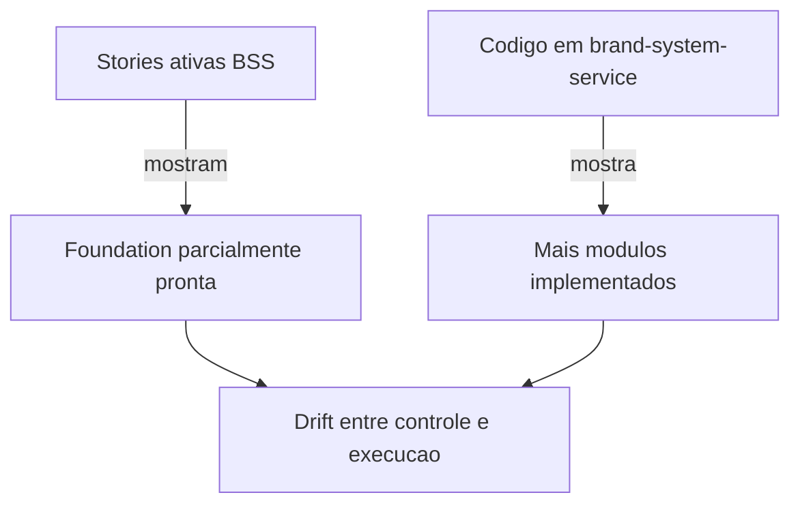

# Brand System Service - Status Report

**Data da analise:** 2026-03-18  
**Escopo analisado:** `docs/prd-brand-system-service.md`, `docs/architecture-brand-system-service.md`, `docs/epics-brand-system-service.md`, stories BSS, e o subprojeto `brand-system-service/`

## 1. O que e este projeto

O **Brand System Service (BSS)** e um servico productizado para entregar presenca digital de marca em formato **static-first**, cobrindo o MVP com 3 pilares:

1. **Brand Identity + Brand Book + Design System**
2. **Criativos para social media**
3. **Landing Pages e Sites**

No modelo atual do PRD v1.2, o MVP prioriza:

- entregaveis em **HTML/CSS/JS**
- **ClickUp** como hub operacional
- **Cloudflare R2** para assets
- **triple delivery** do Brand Book: online + PDF + pacote local
- validacao interna antes de lancamento comercial

## 2. Resumo Executivo

**Leitura curta:** o projeto esta **bem definido e relativamente bem implementado no codigo**, mas **ainda nao parece operacionalmente fechado para lancamento**.

### Diagnostico geral

| Dimensao              | Estado           | Leitura                                                                             |
| --------------------- | ---------------- | ----------------------------------------------------------------------------------- |
| Produto / escopo      | Forte            | PRD, arquitetura e mapa de epicos estao detalhados e coerentes                      |
| Implementacao tecnica | Parcial-avancada | Existe um subprojeto real com varios pacotes e testes                               |
| Controle por story    | Inconsistente    | O codigo esta mais avancado que parte das stories                                   |
| Operacao MVP          | Parcial          | ClickUp/validacao interna ainda aparecem mais como plano do que execucao comprovada |
| Prontidao comercial   | Baixa a media    | Falta consolidar QA, validacao, e fechar divergencias entre docs e codigo           |

### Estimativa de maturidade

> **Inferencia**, nao status oficial do time.

| Area                              | Maturidade estimada |
| --------------------------------- | ------------------: |
| Definicao de produto              |                 90% |
| Arquitetura                       |                 85% |
| Fundacao tecnica                  |                 60% |
| Motores centrais do MVP           |                 55% |
| Operacao / aprovacao / onboarding |                 35% |
| Validacao pre-lancamento          |                 15% |
| **Prontidao geral do MVP**        |          **45-55%** |

## 3. Evidencias encontradas

### Documentacao estrutural

| Artefato                                    | Estado | Observacao                                                |
| ------------------------------------------- | ------ | --------------------------------------------------------- |
| `docs/prd-brand-system-service.md`          | Forte  | PRD v1.2, escopo amplo e revisado                         |
| `docs/architecture-brand-system-service.md` | Forte  | Arquitetura static-first, ClickUp, R2, fase 2 documentada |
| `docs/epics-brand-system-service.md`        | Forte  | 16 epicos, 84 stories, ondas de execucao definidas        |
| `docs/review-prd-brand-system-service.md`   | Forte  | Review tecnico incorporado ao PRD                         |

### Implementacao real encontrada

O subprojeto [`brand-system-service/`](C:\Users\mrapa\projects\my-projects\aios-core\brand-system-service) ja existe como monorepo tecnico com estes pacotes:

| Pacote             | Papel aparente                                  |
| ------------------ | ----------------------------------------------- |
| `core`             | config, logger, R2, seguranca, GDPR, monitoring |
| `tokens`           | design tokens e Style Dictionary                |
| `static-generator` | brand book, PDF, pacote local                   |
| `creative`         | criativos e templates                           |
| `ai-service`       | abstracao de provedores AI, fila, retry         |
| `copy-pipeline`    | pipeline de copy                                |
| `prompts`          | biblioteca/versionamento de prompts             |
| `moderation`       | filtros de conteudo                             |
| `quality`          | scoring e pipeline de qualidade                 |
| `cost`             | rastreamento de custos                          |

### Sinal de profundidade tecnica

| Indicador                                      |           Valor encontrado |
| ---------------------------------------------- | -------------------------: |
| Pacotes no subprojeto                          |                         10 |
| Pastas `__tests__` encontradas                 | varias em `src/` e `dist/` |
| Ocorrencias de `describe(`/`test(` nos pacotes |                        278 |

## 4. Mapa de andamento

### Andamento por camada

| Camada                  | Estado atual                     | Comentario                                                         |
| ----------------------- | -------------------------------- | ------------------------------------------------------------------ |
| Descoberta e estrategia | Concluida                        | O projeto sabe claramente o que quer ser                           |
| Arquitetura             | Concluida / refinada             | A simplificacao v1.2 esta bem absorvida                            |
| Fundacao                | Parcialmente concluida           | Stories 1.1, 1.2, 1.3, 1.6 com bom sinal                           |
| Core engines            | Parcialmente implementados       | Tokens, AI, prompts, moderation, quality existem em codigo         |
| Operacao ClickUp        | Pouca evidencia de execucao real | Muito descrito em docs/stories, pouca prova operacional no repo    |
| Validacao interna       | Ainda pendente                   | Existe o epic `BSS-VAL`, mas nao ha evidencia de execucao completa |

## 5. Status por epic / frente

### EPIC-BSS-1: Foundation & Simplified Infrastructure

| Story   | Status documentado | Leitura pratica                                                                 |
| ------- | ------------------ | ------------------------------------------------------------------------------- |
| BSS-1.1 | Done               | Fundacao do monorepo concluida                                                  |
| BSS-1.2 | Ready for Review   | R2 parece amplamente implementado                                               |
| BSS-1.3 | Ready for Review   | Organizacao/naming parecem implementados                                        |
| BSS-1.4 | Draft              | Story diz draft, mas ha codigo de `security/` no subprojeto                     |
| BSS-1.5 | Draft              | Story diz draft, mas ha codigo de `gdpr/` e scripts                             |
| BSS-1.6 | Ready for Review   | Hosting/config existe, mas a propria story ainda marcava gaps operacionais      |
| BSS-1.7 | Draft              | Story diz draft, mas ha `monitoring/`, `health-check.ts` e doc de monitoramento |

**Conclusao:** o **epic 1 parece mais avancado no codigo do que nas stories**.

### EPIC-BSS-2 a EPIC-BSS-5: Motores do MVP

| Epic                          | Sinal no repo | Leitura                                                                                       |
| ----------------------------- | ------------- | --------------------------------------------------------------------------------------------- |
| BSS-2 Tokens + Brand Book     | Forte         | tokens, static-generator, templates, PDF/package builder existem                              |
| BSS-3 AI + Prompt Engineering | Forte         | ai-service, prompts, copy-pipeline, moderation, cost existem                                  |
| BSS-4 Creative Production     | Medio-forte   | creative, templates por plataforma, batch pipeline existem                                    |
| BSS-5 Landing Pages & Sites   | Medio         | ha build/static-generator, mas a maturidade de templates finais precisa confirmacao funcional |

### EPIC-BSS-6 a EPIC-BSS-8: Operacao e QA

| Epic                       | Sinal no repo | Leitura                                                                                        |
| -------------------------- | ------------- | ---------------------------------------------------------------------------------------------- |
| BSS-6 ClickUp Operations   | Fraco a medio | stories detalhadas, mas pouca evidencia concreta de configuracao operacional viva              |
| BSS-7 Onboarding + Audit   | Medio         | stories existem; ha referencias a audit, mas nao esta claro se fluxo ponta a ponta esta pronto |
| BSS-8 QA / Review Pipeline | Medio         | quality pipeline existe em codigo; processo operacional ainda parece incompleto                |

### EPIC-BSS-VAL e Phase 2

| Frente                              | Estado                                        |
| ----------------------------------- | --------------------------------------------- |
| BSS-VAL Validation Program          | Planejado, sem evidencia de execucao completa |
| BSS-15 Client Portal / Multi-tenant | Deliberadamente adiado                        |

## 6. Divergencia mais importante

### O que isso significa

| Problema                                                 | Impacto                                               |
| -------------------------------------------------------- | ----------------------------------------------------- |
| Stories em `Draft` enquanto codigo correspondente existe | Fica dificil confiar no quadro de andamento           |
| Status operacional nao acompanha a implementacao tecnica | Risco de achar que o MVP esta mais pronto do que esta |
| Quality gates nao aparecem amarrados ao status real      | Risco de lacunas antes do lancamento                  |

## 7. O que falta

### Para considerar o MVP tecnicamente consolidado

| Falta                                                           | Motivo                                                     |
| --------------------------------------------------------------- | ---------------------------------------------------------- |
| Fechar e revisar formalmente BSS-1.2, BSS-1.3, BSS-1.6          | Sao base oficial do Wave 2                                 |
| Atualizar BSS-1.4, BSS-1.5, BSS-1.7 para refletir o codigo real | Hoje ha desalinhamento                                     |
| Mapear status real de BSS-2 a BSS-8 contra o codigo             | O repo tem muito mais implementacao do que o board reflete |
| Executar gates tecnicos em ambiente reproduzivel                | Lint, typecheck, testes e builds precisam ser comprovados  |
| Validar entrega tripla do Brand Book ponta a ponta              | online + PDF + pacote local                                |
| Validar Landing Page/Site build e deploy reais                  | Ainda nao ficou comprovado na analise documental           |

### Para considerar o MVP operacional

| Falta                                           | Motivo                                                       |
| ----------------------------------------------- | ------------------------------------------------------------ |
| Configuracao real de ClickUp                    | O PRD depende disso como hub do MVP                          |
| Fluxo de onboarding e aprovacao testado         | E parte central do servico                                   |
| Checklists de QA realmente usados               | Sem isso a promessa de qualidade fica teorica                |
| Registro de learnings e referenciais do BSS-VAL | Sem validacao interna, o lancamento comercial fica prematuro |

### Para considerar o MVP pronto para venda

| Falta                                     | Motivo                          |
| ----------------------------------------- | ------------------------------- |
| Executar 3-5 projetos de referencia       | Requisito explicito do PRD v1.2 |
| Confirmar ausencia de issues bloqueadoras | Criterio do epic de validacao   |
| Ajustar backlog com base em learnings     | Fecha o ciclo de produto        |

## 8. Leitura de risco

| Risco                            | Nivel      | Observacao                                                                |
| -------------------------------- | ---------- | ------------------------------------------------------------------------- |
| Drift entre stories e codigo     | Alto       | Ja esta acontecendo                                                       |
| Ilusao de progresso              | Alto       | O repo parece mais pronto do que o processo operacional prova             |
| Operacao ClickUp nao consolidada | Medio-Alto | E um pilar do MVP simplificado                                            |
| Validacao interna nao executada  | Alto       | Bloqueia lancamento seguro                                                |
| Phase 2 confundir foco do MVP    | Medio      | O portal multi-tenant esta corretamente adiado; nao deve contaminar o MVP |

## 9. Recomendacao objetiva

### Estado recomendado do projeto hoje

> **Projeto em fase de implementacao avancada de MVP, mas ainda nao em fase de lancamento.**

### Ordem recomendada de trabalho

1. **Reconcilia status**
   Atualizar stories e epics para refletir o que ja existe em `brand-system-service/`.

2. **Provar o que existe**
   Rodar e registrar gates, builds e fluxos ponta a ponta do Brand Book e Landing Page.

3. **Fechar operacao MVP**
   ClickUp, aprovacao, revisao, onboarding e QA.

4. **Executar BSS-VAL**
   Projetos de referencia + learnings + backlog.

5. **So depois pensar em launch**
   O PRD esta correto em exigir validacao antes de clientes reais.

## 10. Veredito final

| Pergunta                                      | Resposta                                                                                |
| --------------------------------------------- | --------------------------------------------------------------------------------------- |
| O que este projeto e?                         | Um servico productizado de brand system static-first com 3 pilares de MVP               |
| O projeto esta bem definido?                  | Sim, muito                                                                              |
| O projeto ja tem implementacao real?          | Sim, bastante                                                                           |
| O andamento esta linear e confiavel?          | Nao totalmente; ha drift entre stories e codigo                                         |
| O que mais falta?                             | Operacao real, validacao interna, reconciliacao de status e prova tecnica ponta a ponta |
| Pode ser tratado como pronto para lancamento? | Ainda nao                                                                               |

---

## 11. Observacoes da validacao desta analise

Durante a analise, houve tentativa de rodar gates tecnicos locais, mas o ambiente apresentou limitacoes:

- `pnpm` nao estava disponivel no PATH
- tentativas via `npm` pegaram scripts/ambiente do repo principal e nao validaram corretamente o subprojeto
- execucoes com cache/processos tambem sofreram `EPERM`

Por isso, a conclusao acima combina:

- **evidencia direta de arquivos/codigo**
- **status declarado nas stories**
- **inferencias controladas** sobre maturidade e prontidao
